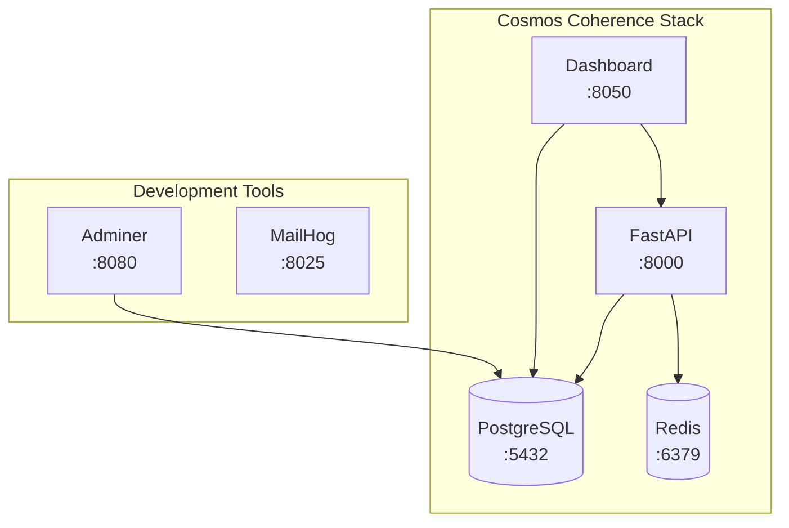

# Docker Setup Guide

## Quick Start

### Prerequisites

- Docker Desktop (version 20.10 or higher)
- Docker Compose (version 2.0 or higher)
- 4GB+ available RAM
- 10GB+ available disk space

### Getting Started

1. **Clone the repository**:
   ```bash
   git clone https://github.com/yourusername/cosmos-coherence.git
   cd cosmos-coherence
   ```

2. **Set up environment**:
   ```bash
   cp .env.example .env
   # Edit .env with your API keys
   ```

3. **Start development environment**:
   ```bash
   ./scripts/start-dev.sh
   ```

4. **Access services**:
   - API: http://localhost:8000
   - Dashboard: http://localhost:8050
   - Database Admin: http://localhost:8080
   - Mail Testing: http://localhost:8025

## Architecture Overview



## Service Configuration

### API Service

- **Image**: Python 3.11-slim based
- **Framework**: FastAPI with Uvicorn
- **Port**: 8000
- **Features**:
  - Hot reload in development
  - Health check endpoint
  - Prometheus metrics
  - Structured logging

### Dashboard Service

- **Image**: Python 3.11-slim based
- **Framework**: Dash with Plotly
- **Port**: 8050
- **Features**:
  - Interactive visualizations
  - Real-time updates
  - Responsive design

### Database Service

- **Image**: PostgreSQL 15 Alpine
- **Port**: 5432
- **Credentials**: cosmos/cosmos (development)
- **Database**: cosmos_coherence
- **Features**:
  - Persistent storage
  - Automated backups
  - Health monitoring

### Cache Service

- **Image**: Redis 7 Alpine
- **Port**: 6379
- **Persistence**: AOF enabled
- **Features**:
  - In-memory caching
  - Pub/sub messaging
  - Session storage

## Development Workflow

### Starting Services

```bash
# Start all services
docker compose up -d

# Start specific service
docker compose up -d api

# View logs
docker compose logs -f api

# Stop all services
docker compose down
```

### Making Changes

1. **Code changes**: Automatically reloaded (hot reload)
2. **Dependencies**: Rebuild required
   ```bash
   docker compose build api
   docker compose up -d api
   ```
3. **Configuration**: Restart service
   ```bash
   docker compose restart api
   ```

### Debugging

```bash
# Access container shell
docker exec -it cosmos-api bash

# View real-time logs
docker compose logs -f

# Check service status
docker compose ps

# Inspect container
docker inspect cosmos-api
```

## Production Deployment

### Prerequisites

1. **Configure production environment**:
   ```bash
   cp .env.production.example .env.production
   # Edit with production values
   ```

2. **Set up SSL certificates** (optional):
   ```bash
   # Using Let's Encrypt
   docker compose -f docker-compose.yml -f docker-compose.prod.yml up -d certbot
   ```

### Deployment Steps

```bash
# Deploy to production
./scripts/deploy.sh production

# Or manually:
docker compose -f docker-compose.yml -f docker-compose.prod.yml up -d
```

### Production Features

- Resource limits enforced
- Read-only configuration mounts
- SSL/TLS support
- Automated backups
- Health monitoring
- Log aggregation

## Environment Configuration

### Development (.env.development)

```env
ENVIRONMENT=development
DEBUG=true
LOG_LEVEL=DEBUG
DATABASE_URL=postgresql://cosmos:cosmos@db:5432/cosmos_coherence
REDIS_URL=redis://redis:6379/0
```

### Production (.env.production)

```env
ENVIRONMENT=production
DEBUG=false
LOG_LEVEL=WARNING
DATABASE_URL=${DATABASE_URL}
REDIS_URL=${REDIS_URL}
SECRET_KEY=${SECRET_KEY}
```

## Data Management

### Backup

```bash
# Run backup
./scripts/backup.sh

# Automated daily backup (add to crontab)
0 2 * * * /path/to/scripts/backup.sh
```

### Restore

```bash
# List available backups
./scripts/restore.sh

# Restore specific backup
./scripts/restore.sh 20240101_120000.tar.gz
```

### Volume Management

```bash
# List volumes
docker volume ls | grep cosmos-coherence

# Inspect volume
docker volume inspect cosmos-coherence_postgres-data

# Clean volumes (WARNING: Data loss!)
docker compose down -v
```

## Monitoring & Maintenance

### Health Checks

```bash
# Run health check
./scripts/health-check.sh

# Check specific service
curl http://localhost:8000/health
```

### Resource Usage

```bash
# Check container stats
docker stats

# Check disk usage
docker system df

# Clean unused resources
docker system prune -a
```

### Log Management

```bash
# View logs
docker compose logs api

# Follow logs
docker compose logs -f

# Export logs
docker compose logs > cosmos-logs.txt
```

## Troubleshooting

### Common Issues

#### Services Won't Start

```bash
# Check for port conflicts
lsof -i :8000
lsof -i :5432

# Check Docker resources
docker system df
docker system prune -a
```

#### Database Connection Failed

```bash
# Check database status
docker compose ps db
docker compose logs db

# Test connection
docker exec cosmos-db pg_isready -U cosmos
```

#### Permission Denied

```bash
# Fix file permissions
sudo chown -R $USER:$USER .
chmod -R 755 scripts/
```

#### Out of Memory

```bash
# Increase Docker memory (Docker Desktop)
# Preferences > Resources > Memory: 4GB+

# Check memory usage
docker stats --no-stream
```

### Reset Everything

```bash
# Stop and remove everything
docker compose down -v
docker system prune -a

# Fresh start
docker compose build --no-cache
docker compose up -d
```

## Security Considerations

### Development

- Default credentials (change in production)
- Debug mode enabled
- All ports exposed
- Hot reload enabled

### Production

- Strong passwords required
- Debug mode disabled
- Limited port exposure
- SSL/TLS enabled
- Non-root user
- Read-only mounts
- Resource limits
- Security headers

## Performance Optimization

### Docker Settings

```yaml
# docker-compose.prod.yml
deploy:
  resources:
    limits:
      cpus: '2'
      memory: 2G
    reservations:
      cpus: '0.5'
      memory: 512M
```

### Build Optimization

- Multi-stage builds
- Layer caching
- Minimal base images
- Combined RUN commands

### Runtime Optimization

- Connection pooling
- Redis caching
- Async processing
- Load balancing

## CI/CD Integration

### GitHub Actions

```yaml
name: Docker CI
on: [push]
jobs:
  test:
    runs-on: ubuntu-latest
    steps:
      - uses: actions/checkout@v2
      - name: Build and test
        run: |
          docker compose build
          docker compose run --rm api pytest
```

### Deployment Pipeline

1. Run tests
2. Build images
3. Push to registry
4. Deploy to server
5. Run health checks

## Appendix

### Useful Commands

```bash
# Remove all containers
docker rm -f $(docker ps -aq)

# Remove all images
docker rmi -f $(docker images -q)

# Copy files from container
docker cp cosmos-api:/app/data/output.csv ./

# Execute command in container
docker exec cosmos-api python -m pytest

# View container processes
docker top cosmos-api

# Export/import images
docker save cosmos-coherence:latest | gzip > cosmos.tar.gz
docker load < cosmos.tar.gz
```

### Environment Variables Reference

| Variable | Description | Default |
|----------|-------------|---------|
| ENVIRONMENT | Environment name | development |
| DEBUG | Debug mode | true |
| LOG_LEVEL | Logging level | INFO |
| DATABASE_URL | PostgreSQL connection | postgresql://... |
| REDIS_URL | Redis connection | redis://... |
| API_HOST | API bind address | 0.0.0.0 |
| API_PORT | API port | 8000 |
| WORKERS | Worker processes | 4 |

### Port Reference

| Service | Internal | External | Purpose |
|---------|----------|----------|---------|
| API | 8000 | 8000 | REST API |
| Dashboard | 8050 | 8050 | Web UI |
| PostgreSQL | 5432 | 5432 | Database |
| Redis | 6379 | 6379 | Cache |
| Adminer | 8080 | 8080 | DB Admin |
| MailHog | 8025 | 8025 | Email Testing |

### File Structure

```
cosmos-coherence/
├── docker-compose.yml           # Main configuration
├── docker-compose.override.yml  # Development overrides
├── docker-compose.prod.yml      # Production overrides
├── Dockerfile                   # Multi-stage build
├── .dockerignore               # Build exclusions
├── .env.example                # Environment template
├── scripts/
│   ├── deploy.sh              # Deployment script
│   ├── start-dev.sh          # Development startup
│   ├── start-prod.sh         # Production startup
│   ├── backup.sh             # Backup utility
│   ├── restore.sh            # Restore utility
│   └── health-check.sh       # Health monitoring
└── docs/
    ├── docker-guide.md       # This guide
    └── volume-management.md  # Volume documentation
```
